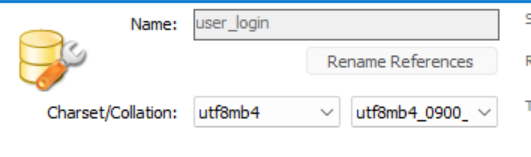

复制下面命令到终端运行---来安装依赖库 这期间可能会有错误，但是都很简单应该，去搜索一下就好了

pip install flask flask_sqlalchemy flask_login flask_wtf pymysql email_validator

安装完依赖之后去你的MySQL中创建你的数据库数据表

之后把对应的内容写进app目录下面的config.py里面

对应的有你MySQL的账户和密码，还有你数据库的名称（这些你都自己设定就好了，下面是我的设置）

可以运行数据库初始化文件（ createdb.py ）在第一次运行前先建表和创建用户，然后再运行 run.py。

现在项目就能很好的运行起来啦~

---

接下来就是我的首页，这是未登录状态，登录后才可以查看具体的信息内容
